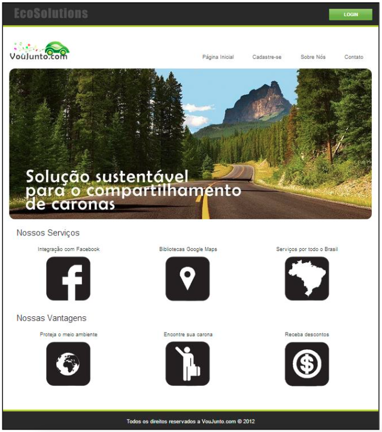
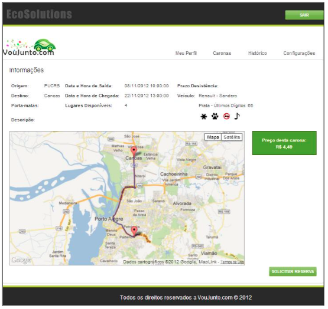
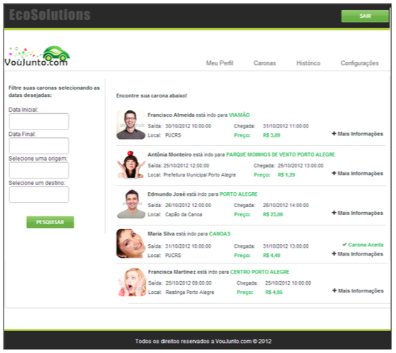
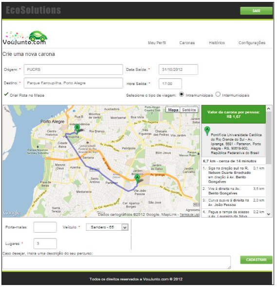

<h1>VouJuntoCom - A social "ridesharing"</h1>

VouJuntoCom is a social network developed by Cassia Almeida in 2012 where people can share rides with their 
Facebook friends receiving money for it.

This application aims to reduce both the flow of vehicles and the emission of greenhouse gases 
in the atmosphere through the development of a rides’ system. The system is based on buying and 
selling seats in a vehicle for short or long travels, presenting advantageous for the donor and 
the recipient of the ride because it allows them to behave better in relation with the environment 
and receive a financial compensation for it. Moreover, the system is integrated with social networks, 
allowing only the user’s contacts to have access to the rides offered by him, avoiding the insecurity 
problem (when the users does not have the knowledge of who is in his car).

<i>Since this project was developed to a Brazilian University, all the pages were written in portuguese.</i>

<h3>1. Technical Information</h3>
<ul>
  <li>Developed using Visual Studio 2012;</li>
  <li>ASP.NET MVC 3.0 Framework;</li>
  <li>SQL Server Express database;</li>
  <li>HTML5 and CSS3;</li>
  <li>API Google Maps;</li>
  <li>Integration with more then 300 social networks to share rides, such as Facebook, Twitter, Linkedin, Pinterest, MySpace and Google Plus;</li>
  <li>MVC Architechture (Model-View-Controller)</li>
</ul>

<h3>2. Browsers Supported</h3>
<ul>
  <li>IE9 and IE8;</li>
  <li>Firefox 3.5.x to 13;</li>
  <li>Google Chrome 10 to 19;</li>
  <li>Safari 4 e 5</li>
</ul>

<h3>3. Application Screenshots</h3>

<h5>3.1 Home Page</h5>

 

<h5>3.2 Ride Creation</h5>

 

<h5>3.3 Friends List</h5>

 

<h5>3.4 Accepting a Ride</h5>

 

<h5>3.5 User Home Page</h5>

 
